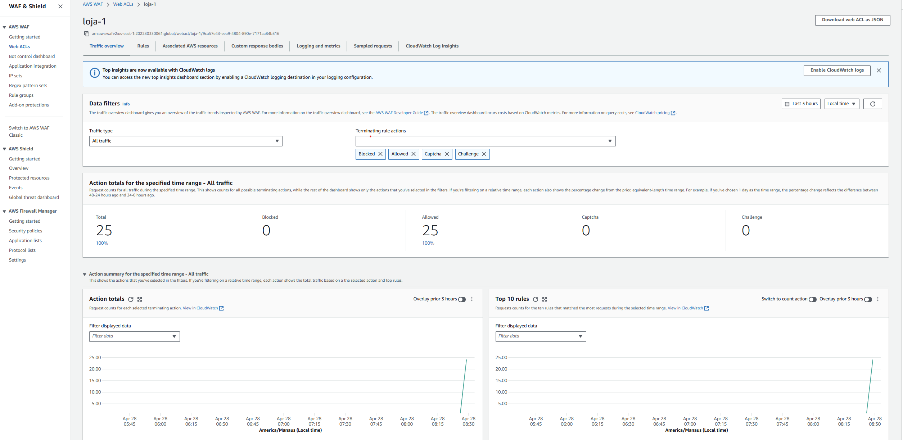

  
  
  
  
  

 

<h3 align="center">Metricas AWS WAF</h3>

  

 

## Funcionalidades

- [X] Cadastro de usuários.
- [X] Criação de anúncios.
- [X] Realização de pedidos.
- [X] Carrinho de compras.
- [X] Buscar produtos.
- [X] Upload de imagems com Multer.
- [X] Páginas dinâmicas com Nunjucks.
- [X] Banco de dados PostgreSQL.
- [X] Sistema de login e recuperação de senha.
- [X] Animações com Lottie.

 

## Tecnologias e Ferramentas

As seguintes tecnologias foram utilizadas no desenvolvimento do projeto:

- [AWS RDS]
- [AWS CLOUDWATCH]
- [AWS WAF]
- [AWS EC2]
- [AWS CLOUDFRONT]
- [ELASTICSEARCH]
- [Node.js]
- [HTML]
- [CSS]

 

